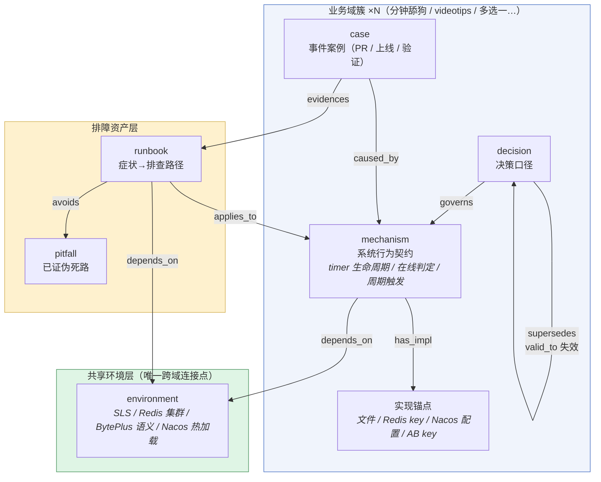

# 04 知识图谱设计（以 ses_02446e44 为实例）

> 目标：知识**成体系**——高内聚（同域知识聚成一簇）、低耦合（域与域不直接相连，只经共享层发生关系）。
> 两张图：① 本体论（schema：节点类型 + 边类型，相当于"类图"）；② 本会话实例图（相当于"对象图"）。

## 设计原则

1. **节点分六类**（kind 是封闭枚举，提取管线只允许产出这些）：
   `mechanism`（系统行为契约）/ `runbook`（排障路径）/ `decision`（决策口径）/ `environment`（环境与工具姿势）/ `pitfall`（已证伪死路）/ `case`（事件案例，证据）。
2. **边分八种**（rel 也是封闭枚举）：
   `has_impl`（契约→实现锚点）/ `governs`（决策→约束对象）/ `supersedes`（口径演化，带 valid_to）/ `applies_to`（排障路径→适用机制）/ `depends_on`（机制→环境）/ `avoids`（runbook→死路）/ `evidences`（案例→佐证）/ `caused_by`（案例→根因）。
3. **分簇规则**：按**业务域**聚簇（分钟舔狗 / videotips / 多选一实验），域内全互联；**域间零直连**，共享的东西（SLS、Redis、BytePlus 语义、Nacos）一律下沉到「共享环境层」——这就是低耦合的结构保证：某个域整体废弃时，删掉它的簇不影响其他簇。
4. **pitfall 只挂 runbook，不挂机制**：死路是"排查动作的教训"，不是系统的属性。

---

## 图 ① 本体论（schema 层）



**这就是"继承/引用/接口实现"的落法：**
- `mechanism` = 接口（行为契约，稳定）；
- 实现锚点 = 实现（文件/key/配置，易变）——接口与实现分离，代码重构只改锚点不动契约；
- `supersedes` 链 = 口径的"继承与覆写"，旧口径不删除而是 `valid_to` 失效（Graphiti 式双时间）；
- 簇 = 包（package），共享环境层 = 公共依赖库，域间无 import。

---

## 图 ② 本会话实例图（ses_02446e44 提取结果）

```mermaid
flowchart TB
  subgraph D1["域簇 1：分钟舔狗 NewMinuteDog"]
    direction TB
    M1["mechanism: timer 生命周期<br/>maleId 维度 ZSET；不记来源 PWA<br/>（B 的消息重置 A 的任务）"]
    M2["mechanism: 路由表<br/>普通/回声→Reset<br/>击穿→EnsureOnly"]
    M3["mechanism: 选人<br/>pwa_recent 倒序<br/>空时回退 recent_chats"]
    M4["mechanism: 已知边界<br/>无候选 PWA 时无限空转"]
    I1["锚点: new_minute_dog:timers<br/>/ pwa_recent / sent:{male}"]
    I2["锚点: NewMinuteDog{Service,Store,<br/>Executor,Router}.kt"]
    I3["锚点: Nacos new_texas_minute_dog_config"]
    I4["锚点: AB new_texas_minute_dog<br/>prod 24h 命中 1370 次"]
    DE1["decision: 滚动 24h ZSET 窗口<br/>（按天 INCR 会午夜清零）"]
    DE2["decision: 击穿只建不重置<br/>（08-10 起）"]
    DE2old["decision: 击穿完全 Skip<br/><s>已失效</s>"]
    DE3["decision: 男消息只顺延不新建<br/>不打 AB 查询"]
    C1["case: PR #932<br/>冷静期顺延+窗口上限+可分发放宽"]
    C2["case: PR #961<br/>选人改序+击穿 EnsureOnly"]
  end

  subgraph D2["域簇 2：videotips"]
    direction TB
    M5["mechanism: 周期随机触发<br/>N 轮/周期抽 3 点，间隔≥4"]
    M6["mechanism: 命中轮被挡 = 永久丢失<br/>下周期重抽不补发"]
    M7["mechanism: 在线判定 isPwaOnline<br/>心跳∪ + 状态∈{1,2}，fail-closed"]
    I5["锚点: Nacos video_tips_config<br/>prod 已改 rounds_per_trigger=10"]
    I6["锚点: Redis user:client:online:status:records<br/>值是枚举名字符串，非数字"]
    I7["锚点: AB new_texas_video_tips<br/>aggressiveGate 已在 prod 生效"]
    DE4["decision: PWA 判定移出可分发校验<br/>VideoCallHelper 路径未动"]
    DE5["decision: 聊过前 0 轮<br/>（实验命中时去掉 3 轮安全垫）"]
    C3["case: PR #950 在线判定改造"]
    C4["case: PR #951 aggressive gate"]
  end

  subgraph D3["域簇 3：多选一实验 multi_candidate"]
    direction TB
    M8["mechanism: AgentLoop 两臂<br/>structured / parallel + 打分器"]
    M9["mechanism: flat anchor commitHint<br/>按臂适配（structured 要求 ONCE+3候选）"]
    I8["锚点: Nacos candidate_gen_config<br/>enabled 是紧急回退总开关"]
    I9["锚点: AB multi_candidate_audit"]
    C5["case: PR #962 删旧管线<br/>4 commit 含 CancellationException fix"]
  end

  subgraph SHARED["共享环境层（跨域唯一通道）"]
    direction TB
    E1["env: SLS 查询<br/>dev/prod 双 project<br/>tag __tag__:_service_name_:aichat-v2"]
    E2["env: dev Redis 集群模式<br/>跨 key Lua 必 CROSSSLOT<br/>改用批量命令"]
    E3["env: BytePlus 语义<br/>__no_experiment__=没进实验≠对照组<br/>10s 负缓存；白名单分钟级同步"]
    E4["env: Nacos 热加载<br/>aichat_v2_feature_flags<br/>改配置日志才说明生效"]
    E5["env: e2e 打流量<br/>doni-android app=11<br/>llm_raw 逐条核实"]
  end

  subgraph TROUBLE["排障资产层"]
    direction TB
    RB1["runbook: 实验没生效排查<br/>时间线→个案vs整体→版本→SENTINEL复现<br/>→恢复后需 PWA 消息或重新上下线"]
    RB2["runbook: 舔狗未触发排查<br/>查 timer/state/在线/实验 四元组"]
    RB3["runbook: 实验分组验证<br/>e2e 打流量→收 traceId→llm_raw 核对"]
    P1["pitfall: 30 分钟抽样判实验死活<br/>→ 必须 24h SQL 聚合"]
    P2["pitfall: Nacos HTTP API 需 AK，走不通"]
    P3["pitfall: gradle run 写死 ApplicationKt<br/>→ 用一次性测试类"]
    P4["pitfall: git cherry 标 + 只因 patch-id 变<br/>→ 对文件内容 diff 才作数"]
  end

  %% 域内：契约→实现
  M1 -->|has_impl| I1
  M1 -->|has_impl| I2
  M2 -->|has_impl| I2
  M3 -->|has_impl| I1
  M1 -.->|has_impl 配置| I3
  M2 -.->|has_impl 开关| I4
  M5 -->|has_impl| I5
  M7 -->|has_impl| I6
  M5 -.->|has_impl 开关| I7
  M8 -->|has_impl| I8
  M8 -.->|has_impl 开关| I9

  %% 域内：决策治理 + 演化
  DE1 -->|governs| M1
  DE2 -->|governs| M2
  DE3 -->|governs| M1
  DE4 -->|governs| M7
  DE5 -->|governs| M5
  DE2 -->|supersedes| DE2old

  %% 案例 → 证据/根因
  C1 -->|evidences| RB2
  C2 -->|evidences| RB2
  C3 -->|evidences| RB1
  C4 -->|evidences| RB1
  C5 -->|evidences| RB3
  C1 -.->|caused_by| M1
  C4 -.->|caused_by| M6

  %% 排障层 → 机制/死路
  RB1 -->|applies_to| M2
  RB1 -->|applies_to| M5
  RB2 -->|applies_to| M1
  RB3 -->|applies_to| M8
  RB1 -->|avoids| P1
  RB1 -->|avoids| P2
  RB1 -->|avoids| P3
  RB2 -->|avoids| P4

  %% 跨域唯一通道：依赖共享环境层
  M1 ==>|depends_on| E1
  M3 ==>|depends_on| E2
  M2 ==>|depends_on| E3
  M5 ==>|depends_on| E4
  M8 ==>|depends_on| E5
  RB1 ==>|depends_on| E3
  RB2 ==>|depends_on| E1

  style D1 fill:#F0F4FC,stroke:#5178C6
  style D2 fill:#EAE2FE,stroke:#8569CB
  style D3 fill:#FEE3E2,stroke:#D25D5A
  style SHARED fill:#DFF5E5,stroke:#509863
  style TROUBLE fill:#FEF1CE,stroke:#D4B45B
```



---

## 召回时怎么走这张图

```
"女 2100063736 舔狗又没触发"
  │ FTS 命中症状词「没触发/舔狗」
  ▼
RB2（舔狗未触发排查）  ──applies_to──▶ M1（timer 生命周期）
  │                                     │
  ├──avoids──▶ P4（别用 git cherry 误判）│──has_impl──▶ I1（要查的 Redis key 清单）
  │                                     │
  ╰══depends_on══▶ E1（SLS 查询模板）    ╰──governs◀── DE3（只顺延不新建）
                                        ▲
                            C2（PR #961 改了什么）──caused_by
```

**一次召回 = 命中 1 个 runbook + 沿边扩散 1 跳（机制→锚点→决策），~1k token 注入，下一步动作直接可执行。**

## 高内聚低耦合怎么体现在图上

| 性质 | 结构保证 |
|---|---|
| 高内聚 | 域簇内机制/决策/案例/锚点全互联；一个域的知识一次召回拿全 |
| 低耦合 | 三个域簇之间**没有任何直连边**；共享知识全部下沉环境层（粗线 `depends_on` 是唯一跨簇边类型） |
| 可演化 | `supersedes` 链 + `valid_to`，口径翻案留痕（DE2→DE2old） |
| 可删除 | 某域下线 = 删整个簇，环境层和排障层不受影响 |

## 存储映射（和 02/03 设计对齐）

- 节点 → `memories` 表（`kind` 六枚举 + `domain` 列标识簇 + `attrs` JSON 放 anchors/triggers）
- 边 → `edges` 表（`rel` 八枚举 + 双时间）
- `triggers`（症状词）→ FTS5；语义相近 → 向量；图遍历（supersedes 链、applies_to 反查）→ `WITH RECURSIVE`
